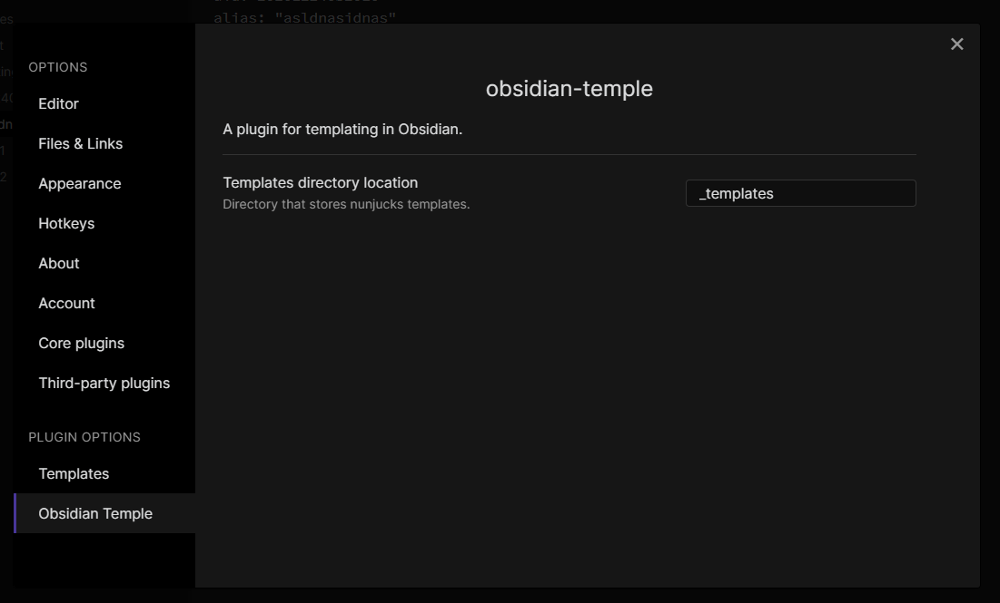
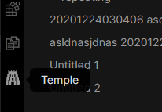
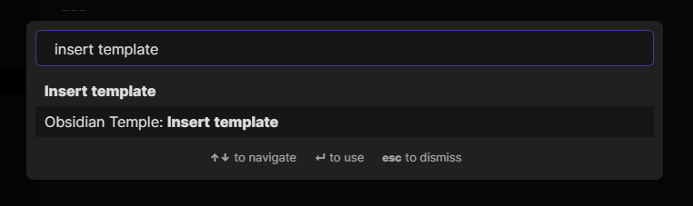
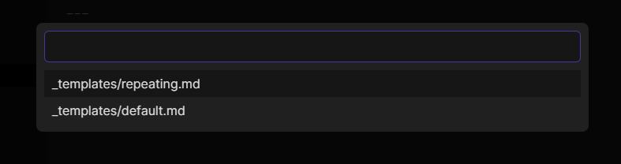

# obsidian-temple

A plugin for templating in Obsidian, powered by [Nunjucks](https://mozilla.github.io/nunjucks/).

## Configuration

Set the directory that contains the templates to be used inside Settings:



## Usages

You can insert a new template by clicking on the button in the sidebar



or via the Command Palette



You will be prompted to choose a template if there are multiple defined



## Templating

Since `obsidian-temple` uses `nunjucks` under-the-hood, you can use everything supported by `nunjucks`. Check the [official Nunjucks documentation](https://mozilla.github.io/nunjucks/templating.html) on how to write `nunjucks` template.

### Example: Populating `alias` based on filename with Zettelkasten ID

```njk
---
uid: {{ zettel.uid }}
alias: "{{ zettel.title }}"
tags: []
---
```

If the filename is `20201224030406 title.md`, then the output of the template will be:

```
---
uid: 20201224030406
alias: "title"
tags: []
---
```

It also works if you have the `uid` as a suffix in the filename, eg: `title 20201224030406.md`.

`zettel` is just one of the objects that are provided by `obsidian-temple`, see [Providers](#providers) for more.

## Providers

`obsidian-temple` currently includes a few providers that can provide the [`context` objects](https://mozilla.github.io/nunjucks/api.html#renderstring) for `nunjucks`:
- `file`
- `zettel`
- `datetime`

You can easily add more providers, see [Adding new provider](#adding-new-provider).

### `file`

Exposes Obsidian's internal [`TFile`](https://github.com/obsidianmd/obsidian-api/blob/d10f2f6efc0d0d7c9bf96cd435ef376b18fbd6d8/obsidian.d.ts#L2206) structure, which means you can use things like `file.name` or `file.basename` in your templates.

### `zettel`

Extracts `uid` and `title` from notes that have the Zettelkasten ID.

### `datetime`

This just returns the current date and time.

## Adding new provider

You need to:

1. create a new context class, `T`
1. implements `ITempleProvider<T>`
1. register the provider on load

For example, for the `datetime` provider:

1. the context class is [`DateTimeContext`](https://github.com/garyng/obsidian-temple/blob/57bc5738dbf35df5403947be769f9f8b2694ddaa/src/providers/DateTimeContext.ts)
1. the provider class is [`DateTimeTempleProvider`](https://github.com/garyng/obsidian-temple/blob/57bc5738dbf35df5403947be769f9f8b2694ddaa/src/providers/DateTimeTempleProvider.ts)
1. the registration is at [`main.ts`](https://github.com/garyng/obsidian-temple/blob/57bc5738dbf35df5403947be769f9f8b2694ddaa/src/main.ts#L27)

## Alternatives

- [`SilentVoid13/Templater`](https://github.com/SilentVoid13/Templater)